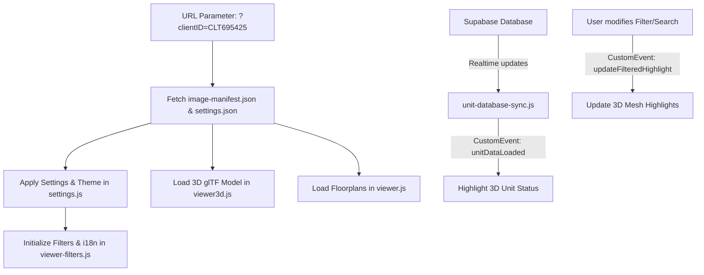

# 360-Viewer Project — AI Agent Product Architecture & System Guide

> **Document Type**: Architecture & System Specification for AI Agents (MDP)  
> **Target Audience**: AI Coding Assistants & Developers maintainers  
> **Last Updated**: July 2026

---

## 1. Executive Summary & Purpose

The **360-Viewer** is a high-performance, WebGL-powered interactive architectural visualization web application tailored for real estate projects. It enables users to explore 3D property models, 2D floor plans, multi-layer unit maps, and virtual showcase tours in real-time.

Key Capabilities:
- **3D Interactive Scene**: Powered by Three.js with glTF/GLB models, dynamic lighting, bloom/glow shaders, raycasting selection, and camera orbit controls.
- **2D Floor Plan Viewer**: Smooth canvas-based pan, zoom, polygon highlighting, and unit status markers.
- **Client Multi-Tenancy**: Dynamic asset loading per client workspace (e.g., `CLT695425`, `CLT695426`) driven by `image-manifest.json` and client-specific `settings.json`.
- **Cloud Database Integration**: Supabase synchronization for live unit availability (Available, Sold, Reserved) and property pricing.
- **Multilingual Support**: Real-time localization dictionary for English (`en`), French (`fr`), and Arabic (`ar`, with full RTL support).
- **Embedded Location Showcase**: Google Maps satellite overlay for real estate geolocation.

---

## 2. Directory Structure & Key Files Map

```
360-Viewer/
├── index.html                  # Main application entry point & layout
├── setup.html                  # Admin GUI for client setup & configuration
├── style.css                   # Master CSS (Glassmorphism UI design system)
├── viewer3d.js                 # Three.js 3D engine, Raycasting, Shaders & SVG Overlays
├── viewer.js                   # 2D Canvas engine, pan/zoom, hotspots & 2D plans
├── viewer-filters.js           # Toolbar controls, double sliders, search, i18n & overlays
├── ui-settings.js              # Theme manager, UI setting definitions & storage
├── settings.js                 # Global settings loader & theme state applier
├── supabase-client.js          # Supabase cloud database client wrapper
├── unit-database-sync.js       # Live database synchronization for unit attributes
├── server.py                   # Local Python development server with CORS support
│
├── CLT695425/                  # Client workspace 1
│   ├── 2D-Plans/               # Floor plan images & SVG polygon masks
│   ├── 3D/                     # 3D glTF/GLB models
│   ├── 3D-Images/              # Rendered 360° panoramas
│   ├── image-manifest.json     # Client asset manifest index
│   └── settings.json           # Client-specific UI & feature overrides
│
├── CLT695426/                  # Client workspace 2
├── git-commit.bat              # Batch tool for local git staging & committing
├── git-push.bat                # Batch tool for pushing commits to GitHub
└── AI-AGENT-GUIDE.md           # This architecture & system guide for AI agents
```

---

## 3. Module Responsibilities & Architecture

### 3.1 3D WebGL Engine (`viewer3d.js`)
- **Three.js Scene Setup**: Initializes renderer, perspective cameras, ambient & directional lights, and post-processing bloom shaders.
- **Raycasting & Hover Selection**: Listens for pointer move/click events on 3D meshes. Computes intersections to highlight units and open information cards.
- **Particle Systems**: Coordinates with `ambient-particles.js` and `box-particles.js` for atmospheric effects.
- **SVG Highlight Overlay**: Renders 2D outline vectors on top of 3D objects for crisp boundary selection.

### 3.2 2D Canvas Viewer (`viewer.js` & `viewer-pan-zoom.js`)
- **Canvas Rendering**: Handles high-DPI rendering of 2D floor plans and 360° panoramic frames.
- **Matrix Transformations**: Controls pan (`translateX`, `translateY`) and scale/zoom with smooth interpolation and bounds clamping.
- **Hotspot Manager**: Renders interactive unit markers with status badges.

### 3.3 Filters, Search & Multilingual System (`viewer-filters.js`)
- **Localization Dictionary**: Contains `TRANSLATIONS` object supporting `en`, `fr`, and `ar`.
- **RTL Support**: Toggles `dir="rtl"` and `.rtl` CSS rules when switching to Arabic.
- **Double Range Sliders**: Custom range controls for Surface Area ($m^2$) and Floor Levels.
- **Fuzzy Search**: Implements alphanumeric fuzzy matching for unit names and numbers.
- **Showcase Overlays**: Manages sliding drawer overlays for Virtual Visit, Location Map, and Contact Form.

### 3.4 Configuration & Customization (`ui-settings.js` & `settings.js`)
- **Settings Hierarchy**: Client-specific `CLTXXXXXX/settings.json` overrides root `settings.json`.
- **Theme Engine**: Dynamic CSS custom properties (`--ui-primary-*`, `--ui-bg-*`, `--ui-border-*`) supporting Dark Mode and Light Mode.
- **Feature Flags**: Dynamically enables/disables Virtual Visit, Location Map, and Contact tabs.

---

## 4. Key Data Flows & Custom Events



### Event Bus Contract:
- `unitDataLoaded`: Emitted when Supabase finishes fetching unit metadata.
- `updateFilteredHighlight`: Emitted by `viewer-filters.js` when user adjusts filters. `viewer3d.js` listens to dim non-matching units.

---

## 5. Geolocation & Google Maps Integration

- **Overlay Element**: `#location-overlay` containing a compact title header and full-viewport map container (`#location-iframe`).
- **Formatter Function**: `formatGoogleMapsEmbedUrl(url)` inside `viewer-filters.js` and `settings.js`.
- **Supported Input Formats**:
  - Coordinates: `"42.1158762,12.7758299"`
  - Google Maps Share Link: `"https://www.google.fr/maps/@42.1158762,12.7758299,139m/..."`
  - Raw Address String: `"123 Champs-Élysées, Paris, France"`
- **Embed Output**: Automatically formats into a satellite map view (`t=k&z=18&output=embed`). Fallback coordinates default to `42.1158762,12.7758299`.

---

## 6. Guidelines for AI Agents Modifying This Codebase

1. **Vanilla Stack Rule**: Avoid introducing heavy frameworks (React, Vue, Tailwind). Keep components modular in pure JavaScript and CSS.
2. **Localization Rule**: When adding new UI text, always add keys to `TRANSLATIONS` in `viewer-filters.js` for `en`, `fr`, and `ar`, and wire them in `setLanguage()`.
3. **Multi-Tenant Safeguard**: Always test changes with explicit `clientID` parameters (`?clientID=CLT695425`).
4. **Git Operations**: Use `git-commit.bat` for local commits and `git-push.bat` to sync with GitHub.
